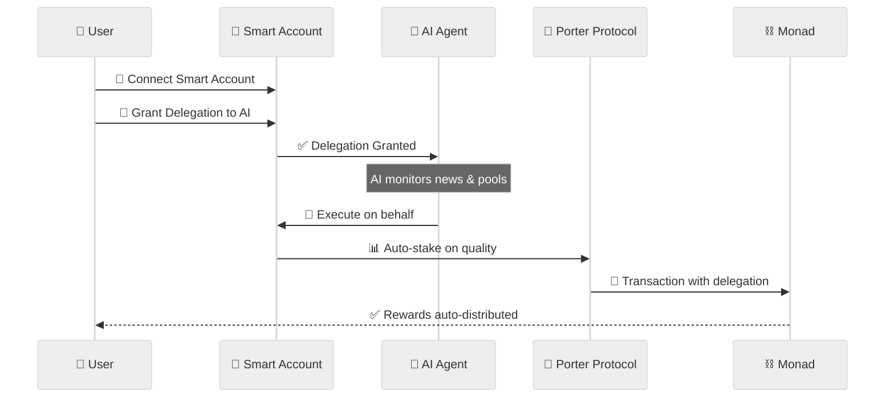

# Porter News - Information Finance Protocol on Monad

**MetaMask Smart Accounts Hackathon x Monad x Envio Submission**

[🌐 Live Demo](https://porter-news.vercel.app/) • [🔮 Farcaster MiniApp](https://farcaster.xyz/miniapps/gM4PKvjzcF47/forter) • [📺 Demo Video](https://www.youtube.com/watch?v=Dxlh9GIQCZM)

---

## 📖 Overview

Porter News transforms credible information into financial assets through **permissionless prediction markets** powered by MetaMask Smart Accounts. We're building an **information finance layer** where analysts earn yield on accuracy and build verifiable on-chain reputation.

**Core Innovation**: Permissionless News + Independent Pools + Smart Account Delegation

1. **Anyone can create NEWS** - Permissionless predictions with clear resolution criteria
2. **Anyone can create POOLS** - Independent analysis with reasoning and separate stake pools
3. **Stake on specific pools** - Back credible reasoning, not just outcomes
4. **Delegate with Smart Accounts** - Grant permissions to AI agents for automated execution

**Tagline**: *"Stake on Credibility, Not Luck"*

---

## 🎯 Hackathon Submission

### Target Track: Best Consumer Application

**✅ Completed Features:**

- **MetaMask Smart Accounts Integration** - Full ERC-4337 & ERC-7710 compatibility with delegation framework
- **Monad Testnet Deployment** - High-performance L1 with 10,000 tps utilized
- **Consumer-Friendly Interface** - Simple, intuitive prediction market experience
- **AI Agent Delegation System** - Users can grant permissions to automated agents

### 📊 Deployed Contracts

**Network**: Monad Testnet (Chain ID: 10143) | **Deploy Date**: October 28, 2025

| Contract | Address | Purpose |
| -------- | ------- | ------- |
| **Forter Main** | [0x27c29A645b7C28814165B1E1139CCBe442e39d3D](https://testnet.monadexplorer.com/address/0x27c29A645b7C28814165B1E1139CCBe442e39d3D) | Core protocol with Smart Account support |
| **StakingPool** | [0x65f253DA810e97Dd3Bf0DFd94b04E8Eb2346cd54](https://testnet.monadexplorer.com/address/0x65f253DA810e97Dd3Bf0DFd94b04E8Eb2346cd54) | Pool staking & rewards with delegation |
| **ReputationNFT** | [0x7eD3eC10bc84042A5b4010665d278081fCdF3e10](https://testnet.monadexplorer.com/address/0x7eD3eC10bc84042A5b4010665d278081fCdF3e10) | Soulbound NFT for reputation tracking |
| **Governance** | [0x3316B62BC48f3a51E62B6417Aa0E35ac71a5d3D0](https://testnet.monadexplorer.com/address/0x3316B62BC48f3a51E62B6417Aa0E35ac71a5d3D0) | Resolution authority & DAO governance |
| **Mock USDC** | [0x16EAfBdC4b33E535f1AEc884b1d1B88fbe2EeEC7](https://testnet.monadexplorer.com/address/0x16EAfBdC4b33E535f1AEc884b1d1B88fbe2EeEC7) | Testnet USDC token (6 decimals) |

---

## 🚀 Key Features

### 1. Permissionless Information Markets
- **No gatekeepers** - Create predictions and analysis without approval
- **Quality emerges organically** - Stakers back the most credible analysis
- **Multiple perspectives coexist** - Independent pools under same prediction

### 2. Independent Pool Economics
Each analyst gets their own stake pool with separate reward distribution:

```
NEWS: "ETH to $5000 by Dec 2024"
├─ Pool 1 (Alice): "YES - ETF approval" → Own stake pool
├─ Pool 2 (Bob): "NO - Regulation risks" → Own stake pool
└─ Pool 3 (Carol): "YES - DeFi growth" → Own stake pool

All resolve together, but distribute rewards independently!
```

### 3. Dynamic Reputation NFTs
Soulbound tokens that update visually based on performance:
- 🥉 Novice (0-49% accuracy) → 🥈 Analyst (50-69%) → 🥇 Expert (70-84%)
- 💎 Master (85-94%) → 👑 Legend (95-100%)
- Portable credentials across Web3 ecosystems

### 4. MetaMask Smart Accounts
- **Gasless transactions** - Paymaster sponsors gas fees
- **Delegation framework** - Grant permissions to AI agents
- **Enhanced security** - Passkey-based recovery
- **Batch operations** - Multiple stakes in single transaction

---

## 🏗️ How It Works

### User Journey

1. **Create NEWS** - Post prediction with clear resolution criteria and timeline
2. **Create POOL** - Write detailed reasoning, stake capital to prove conviction
3. **Community Stakes** - Back specific reasoning ("Agree") or bet against ("Disagree")
4. **Auto-Resolution** - Oracle checks outcome, rewards distribute automatically:
   - **20% to analyst** (if correct) + **80% to winning stakers** + **2% platform fee**
5. **Reputation Update** - NFT tier updates based on accuracy

### MetaMask Smart Accounts Flow



---

## 🛠️ Tech Stack

### Frontend
- **Next.js 15** (App Router) + **TypeScript**
- **TailwindCSS** + **shadcn/ui** for design
- **wagmi** + **viem** + **RainbowKit** for Web3
- **Farcaster MiniApp SDK** for social integration

### Smart Contracts
- **Solidity ^0.8.20** + **Foundry** framework
- **ERC-4337** Smart Accounts + **ERC-721** Soulbound NFTs
- **Monad Testnet** deployment (Chain ID: 10143)

### Infrastructure
- **Vercel** hosting + **Monad RPC** for blockchain
- **Envio** indexing for real-time data

---

## 🚀 Quick Start

### Prerequisites
- Node.js 18+, pnpm, Foundry

### Installation

```bash
# Clone & install
git clone https://github.com/luthfidi/porter-news.git
cd porter-news/frontend
pnpm install

# Setup environment
cp .env.example .env.local
# Edit with your keys (see below)
```

### Environment Variables

```bash
# Core Configuration
NEXT_PUBLIC_WALLET_CONNECT_ID=your_wallet_connect_project_id
NEXT_PUBLIC_MONAD_RPC_URL=https://testnet-rpc.monad.xyz
NEXT_PUBLIC_CHAIN_ID=10143

# Contract Addresses (update after deployment)
NEXT_PUBLIC_TOKEN_ADDRESS=0x16EAfBdC4b33E535f1AEc884b1d1B88fbe2EeEC7
NEXT_PUBLIC_REPUTATION_NFT_ADDRESS=0x7eD3eC10bc84042A5b4010665d278081fCdF3e10
NEXT_PUBLIC_GOVERNANCE_ADDRESS=0x3316B62BC48f3a51E62B6417Aa0E35ac71a5d3D0
NEXT_PUBLIC_PORTER_ADDRESS=0x27c29A645b7C28814165B1E1139CCBe442e39d3D
NEXT_PUBLIC_STAKINGPOOL_ADDRESS=0x65f253DA810e97Dd3Bf0DFd94b04E8Eb2346cd54

# Features
NEXT_PUBLIC_USE_CONTRACTS=true
NEXT_PUBLIC_DELEGATION_ENABLED=true
```

### Run Locally

```bash
cd frontend
pnpm dev
# Open http://localhost:3000
```

### Deploy Contracts

```bash
cd sc
cp .env.example .env
# Add PRIVATE_KEY and MONAD_RPC_URL

forge script script/Deploy.s.sol:DeployScript \
  --rpc-url $MONAD_RPC_URL \
  --private-key $PRIVATE_KEY \
  --broadcast --legacy -vvvv
```

---

## 🎨 Smart Contract Architecture

- **Forter.sol** - Main contract managing news lifecycle and pool orchestration
- **StakingPool.sol** - Per-pool staking logic with independent reward distribution
- **ReputationNFT.sol** - Dynamic soulbound tokens with on-chain metadata updates
- **Governance.sol** - Resolution authority (admin MVP → DAO voting)

---

## 📊 Use Cases

### For Analysts
- Build verifiable on-chain reputation
- Monetize accuracy without large audience
- Earn 20% of pool stakes when correct
- Portable Web3 credentials

### For Stakers
- Back credible analysis, not just outcomes
- Diversify across multiple reasonings
- Earn 80% share of winning pools
- Support emerging analysts

### For DAOs & DeFi
- Source verified analyst credibility
- Use reputation NFTs for governance weighting
- Build trust layers for protocols

---

## 🗺️ Roadmap

### ✅ Phase 0: MVP (Complete)
- Core contracts on Monad + Farcaster MiniApp
- MetaMask Smart Accounts integration
- Mock resolution system

### 🔨 Phase 1: Testnet Launch (Q1 2025)
- Public users + AI oracle resolution
- Enhanced analytics + mobile UI

### 🔨 Phase 2: Mainnet Beta (Q2 2025)
- Monad mainnet + Chainlink oracles
- DAO governance + cross-chain

### 🔨 Phase 3: Ecosystem (Q3-Q4 2025)
- Reputation integrations (DAOs, DeFi)
- Advanced scoring + multi-chain support

---

## 💡 Vision

> *"In a world flooded with noise, credibility is the new currency. Porter makes it liquid."*

We're building infrastructure for the **information economy** where:
- Truth has measurable value
- Credibility becomes liquid capital
- Quality analysis earns real yield
- Reputation compounds across ecosystems

Porter transforms ephemeral social media posts into **verifiable, yield-bearing financial assets**.

---

## 🔗 Links

- **Live Demo**: [porter-news.vercel.app](https://porter-news.vercel.app)
- **GitHub**: [github.com/luthfidi/porter-news](https://github.com/luthfidi/porter-news)
- **Explorer**: [testnet.monadexplorer.com](https://testnet.monadexplorer.com)
- **Twitter**: [@PorterNews](https://twitter.com/PorterNews)
- **Farcaster**: [@porter](https://warpcast.com/porter)

---

**Made with ❤️ for MetaMask Smart Accounts Hackathon x Monad x Envio**
