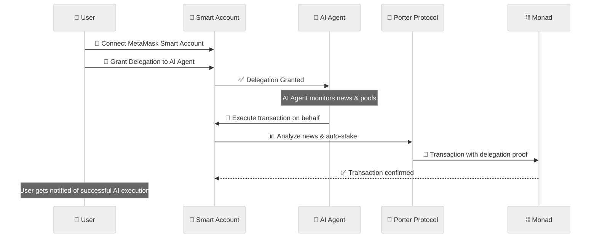

# Porter News - Information Finance Protocol on Monad

<a href="https://porter-news.vercel.app/" target="_blank"></a>
<a href="https://farcaster.xyz/miniapps/gM4PKvjzcF47/forter" target="_blank"></a>
<a href="https://www.youtube.com/watch?v=Dxlh9GIQCZM" target="_blank"></a>

**MetaMask Smart Accounts Hackathon x Monad x Envio Submission**

---

## Overview

Porter News is an **Information Finance Protocol** that transforms credible information into financial assets through permissionless prediction markets powered by MetaMask Smart Accounts. Unlike traditional betting platforms, we enable users to fund quality analysis and build verifiable on-chain reputation with advanced delegation capabilities.

**Core Innovation**: Permissionless News + Independent Pools + Smart Account Delegation

1. **Anyone can create NEWS** - Permissionless predictions with clear resolution criteria
2. **Anyone can create POOL** - Independent analysis with reasoning and separate stake pools
3. **Stake on specific pools** - Back credible reasoning, not just outcomes
4. **Delegate with Smart Accounts** - Grant permissions to AI agents for automated execution

**Tagline**: "Stake on Credibility, Not Luck"

---

## MetaMask Smart Accounts Hackathon x Monad x Envio

Porter News is participating in the **MetaMask Smart Accounts Hackathon x Monad x Envio** with a focus on building next-generation Web3 experiences with account abstraction and user experience.

### Track Alignment

**🎯 Target Track**: Best AI Agent (with Delegation capabilities)

**Key Features for Hackathon**:
- ✅ **MetaMask Smart Accounts Integration** - Full ERC-4337 and ERC-7710 compatibility
- ✅ **Monad Testnet Deployment** - High-performance L1 with 10,000 tps
- ✅ **Delegation Toolkit** - Users can grant permissions to AI agents
- ✅ **Envio Integration** - HyperSync for real-time blockchain data
- ✅ **Automated Execution** - AI agents can act on behalf of users

### Requirements Compliance

| Requirement | Status | Details |
| ----------- | ------ | ------- |
| **MetaMask Smart Accounts** | ✅ | Full integration with delegation support |
| **Monad Testnet** | 🔄 | Deploying to Monad testnet |
| **Delegation Toolkit** | ✅ | Users can delegate to AI agents |
| **Demo Video** | ✅ | Working MetaMask Smart Accounts demo |
| **Envio Usage** | 🔄 | Integrating HyperSync for data indexing |

---

## Deployed Contracts ✅

**Network**: Monad Testnet (Chain ID: 41454) | **Deploy Date**: October 28, 2025

| Contract | Address | Explorer Link | Purpose |
| -------- | ------- | ------------- | ------- |
| **Porter (Main)** | [0x27c29A645b7C28814165B1E1139CCBe442e39d3D](https://testnet.monadexplorer.com/address/0x27c29A645b7C28814165B1E1139CCBe442e39d3D) | 🔍 View | Core protocol contract with Smart Account support |
| **StakingPool** | [0x65f253DA810e97Dd3Bf0DFd94b04E8Eb2346cd54](https://testnet.monadexplorer.com/address/0x65f253DA810e97Dd3Bf0DFd94b04E8Eb2346cd54) | 🔍 View | Pool staking & rewards with delegation |
| **ReputationNFT** | [0x7eD3eC10bc84042A5b4010665d278081fCdF3e10](https://testnet.monadexplorer.com/address/0x7eD3eC10bc84042A5b4010665d278081fCdF3e10) | 🔍 View | Soulbound NFT for reputation |
| **Governance** | [0x3316B62BC48f3a51E62B6417Aa0E35ac71a5d3D0](https://testnet.monadexplorer.com/address/0x3316B62BC48f3a51E62B6417Aa0E35ac71a5d3D0) | 🔍 View | DAO governance contract |
| **USDC Mock** | [0x16EAfBdC4b33E535f1AEc884b1d1B88fbe2EeEC7](https://testnet.monadexplorer.com/address/0x16EAfBdC4b33E535f1AEc884b1d1B88fbe2EeEC7) | 🔍 View | Testnet USDC token (6 decimals) |

---

## MetaMask Smart Accounts Integration

### Delegation Architecture



### Delegation Use Cases

1. **Automated Yield Generation** - AI agents identify high-quality pools and auto-stake
2. **Dollar Cost Averaging** - Regular automated staking across multiple pools
3. **Portfolio Management** - AI manages reputation and stake distribution
4. **Risk Management** - Automated position adjustments based on news outcomes

### Smart Account Features

- **Gasless Transactions** - Sponsored transactions for better UX
- **Passkey Support** - Enhanced security with biometric authentication
- **Permission Sharing** - Granular delegation to AI agents
- **Batch Operations** - Multiple stakes in single transaction

---

## 🎯 What is Porter?

Porter is a **Farcaster Mini App** and **prediction market protocol** that creates an information finance layer where:

- **Anyone can create NEWS** - Permissionless predictions with clear resolution criteria
- **Anyone can create POOLS** - Independent analysis with detailed reasoning and evidence
- **Credibility is measurable** - Dynamic Soulbound NFTs track analyst performance on-chain
- **Quality rises organically** - Stakers back the most credible analysis, not just outcomes

Unlike traditional prediction markets focused on gambling, Porter is an **information marketplace** where analysts earn yield on accuracy and build verifiable reputation.

## 🚀 Key Features

### 1. Permissionless News & Pools
No gatekeepers, no approval needed. Create predictions and analysis freely.

### 2. Independent Pool Economics
Each analyst gets their own stake pool. Multiple perspectives coexist under the same prediction.

```
NEWS: "ETH to $5000 by Dec 2024"
├─ Pool 1 (Alice): "YES - ETF approval" → Own stake pool
├─ Pool 2 (Bob): "NO - Regulation risks" → Own stake pool
└─ Pool 3 (Carol): "YES - DeFi growth" → Own stake pool

All resolve together, but distribute rewards independently!
```

### 3. Dynamic Reputation NFTs
Soulbound tokens that update visually based on performance:
- 🥉 Novice (0-49% accuracy)
- 🥈 Analyst (50-69%)
- 🥇 Expert (70-84%)
- 💎 Master (85-94%)
- 👑 Legend (95-100%)

### 4. Farcaster Native
Built as a Mini App with seamless integration:
- Auto-cast news and pools to your feed
- Embedded frames for in-app interactions
- Social graph-based discovery
- Reputation follows you across Warpcast

### 5. MetaMask Smart Accounts
Powered by ERC-4337 for superior UX:
- Gasless staking transactions
- Delegated pool resolution
- Social recovery with passkeys
- Modular permission system

## 🏗️ How It Works

### User Journey

1. **Create NEWS**
   - Post a prediction with clear resolution criteria
   - Set timeline and category
   - Auto-cast to Farcaster

2. **Create POOL** (Analyst)
   - Write detailed reasoning for position (YES/NO)
   - Add evidence and optional chart images
   - Stake capital to prove conviction
   - Auto-cast with visual preview

3. **Stake on Pools** (Community)
   - Browse pools under any news
   - "Agree" - Back the analyst's reasoning
   - "Disagree" - Bet against their position
   - Diversify across multiple pools

4. **Resolution**
   - Oracle checks outcome at deadline
   - All pools resolve simultaneously
   - Each pool distributes rewards independently:
     - **20% to analyst** (if correct)
     - **80% to winning stakers** (proportional split)
     - **2% platform fee**

5. **Reputation Update**
   - Analyst's NFT tier updates automatically
   - Win/loss history recorded on-chain
   - Credibility compounds over time

## 🛠️ Tech Stack

### Frontend
- **Framework**: Next.js 15 (App Router)
- **Language**: TypeScript
- **Styling**: TailwindCSS + shadcn/ui
- **Web3**: wagmi, viem, RainbowKit, OnchainKit
- **State**: Zustand
- **Social**: Farcaster MiniApp SDK, Neynar API

### Smart Contracts
- **Language**: Solidity ^0.8.20
- **Framework**: Foundry
- **Network**: Monad Devnet (Chain ID: 41455)
- **Standards**: ERC-4337, ERC-721 (Soulbound)

### Infrastructure
- **Deployment**: Vercel
- **RPC**: Monad RPC (https://rpc.monad.xyz)
- **Explorer**: https://testnet.monadexplorer.com

## 📦 Project Structure

```
porter-news/
├── frontend/                 # Next.js application
│   ├── src/
│   │   ├── app/             # App router pages
│   │   ├── components/      # React components
│   │   ├── lib/             # Utilities, hooks, services
│   │   ├── config/          # Contract addresses, admin config
│   │   └── types/           # TypeScript types
│   ├── public/              # Static assets
│   └── package.json
│
└── sc/                      # Smart contracts
    ├── src/                 # Solidity contracts
    ├── script/              # Deployment scripts
    ├── test/                # Contract tests
    └── foundry.toml

```

## 🚀 Quick Start

### Prerequisites
- Node.js 18+
- pnpm (or npm/yarn)
- Foundry (for contracts)

### Installation

```bash
# Clone repository
git clone https://github.com/luthfidi/porter-news.git
cd porter-news

# Install frontend dependencies
cd frontend
pnpm install

# Setup environment variables
cp .env.example .env.local
# Edit .env.local with your keys
```

### Environment Variables

```bash
# Wallet & RPC
NEXT_PUBLIC_WALLET_CONNECT_ID=your_wallet_connect_project_id
NEXT_PUBLIC_MONAD_RPC_URL=https://rpc.monad.xyz
NEXT_PUBLIC_CHAIN_ID=41455

# Contract Addresses (after deployment)
NEXT_PUBLIC_TOKEN_ADDRESS=0x...
NEXT_PUBLIC_REPUTATION_NFT_ADDRESS=0x...
NEXT_PUBLIC_GOVERNANCE_ADDRESS=0x...
NEXT_PUBLIC_PORTER_ADDRESS=0x...
NEXT_PUBLIC_STAKINGPOOL_ADDRESS=0x...

# Farcaster (optional for local dev)
NEXT_PUBLIC_ONCHAINKIT_API_KEY=your_key

# Feature Flags
NEXT_PUBLIC_USE_CONTRACTS=true
```

### Run Locally

```bash
# Frontend
cd frontend
pnpm dev
# Open http://localhost:3000
```

### Deploy Smart Contracts

```bash
cd sc

# Create .env
cp .env.example .env
# Add PRIVATE_KEY and MONAD_RPC_URL

# Deploy to Monad
forge script script/Deploy.s.sol:DeployScript \
  --rpc-url $MONAD_RPC_URL \
  --private-key $PRIVATE_KEY \
  --broadcast \
  --legacy \
  -vvvv

# Generate ABIs for frontend
./scripts/generate-abis.sh
```

## 🎨 Key Contracts

### Forter.sol
Main contract managing news lifecycle and pool orchestration.

### StakingPool.sol
Handles per-pool staking logic with independent reward distribution.

### ReputationNFT.sol
Dynamic soulbound tokens that update metadata based on performance.

### Governance.sol
Resolution authority (admin in MVP, DAO voting in future).

## 🧪 Testing

```bash
# Smart contracts
cd sc
forge test -vvv

# Frontend (coming soon)
cd frontend
pnpm test
```

## 📊 Use Cases

### For Analysts
- Build verifiable on-chain reputation
- Monetize accuracy without needing a large audience
- Earn 20% of pool stakes when correct
- Portable credentials across Web3

### For Stakers
- Back credible analysis, not just outcomes
- Diversify across multiple pools and reasonings
- Earn 80% share of winning pool stakes
- Support emerging analysts

### For DAOs
- Source verified analyst credibility for governance
- Use reputation NFTs for weighted voting
- Access collective intelligence for decisions

### For DeFi Protocols
- Integrate reputation for credit scoring
- Verify analyst track records on-chain
- Build trust layers for lending/borrowing

## 🗺️ Roadmap

### ✅ Phase 0: MVP (Current)
- Core smart contracts deployed on Monad
- Farcaster Mini App with news and pool creation
- MetaMask Smart Accounts integration
- Mock resolution system

### 🔨 Phase 1: Testnet Launch (Q1 2025)
- Public testnet with real users
- AI-assisted resolution via oracles
- Enhanced analytics dashboard
- Mobile-optimized UI

### 🔨 Phase 2: Mainnet Beta (Q2 2025)
- Mainnet deployment on Monad
- Chainlink oracle integration
- DAO governance for resolutions
- Cross-chain expansion

### 🔨 Phase 3: Ecosystem Growth (Q3-Q4 2025)
- Reputation primitive integrations (DAOs, DeFi)
- API for third-party platforms
- Advanced reputation scoring (category expertise)
- Multi-chain support

## 🤝 Contributing

We welcome contributions! Please see our contributing guidelines (coming soon).

## 📄 License

This project is licensed under the MIT License - see the [LICENSE](LICENSE) file for details.

## 🔗 Links

- **Website**: [Coming Soon]
- **Twitter**: [@PorterNews](https://twitter.com/PorterNews)
- **Farcaster**: [@porter](https://warpcast.com/porter)
- **Discord**: [Join Community](https://discord.gg/porter)
- **Docs**: [Documentation](https://docs.porter.xyz)

## 🏆 Hackathon Submission

Built for **MetaMask Smart Accounts Hackathon x Monad x Envio**

### Tracks
- ✅ **Best Farcaster Mini App** (Primary)
- ✅ Best consumer application
- ✅ Most innovative use of Delegations

### Full Project Description

**What is Porter?**

Porter is a Farcaster Mini App that bridges social prediction markets with blockchain-based reputation systems. Unlike traditional prediction markets that focus on gambling, Porter creates an "information finance" layer where:

- **Anyone can create NEWS** - Permissionless predictions with clear resolution criteria
- **Anyone can create POOLS** - Independent analysis with reasoning and evidence
- **Credibility is measurable** - Dynamic Soulbound NFTs track analyst performance on-chain

**How It Works:**

1. **Create NEWS**: Users post predictions (e.g., "ETH to $5000 by December 2024") with resolution dates
2. **Create POOLS**: Analysts write detailed reasoning for their position (YES/NO) and stake capital
3. **Community Stakes**: Others can back specific pools ("Agree" with reasoning) or bet against them ("Disagree")
4. **Resolution & Rewards**: When NEWS resolves, each pool distributes rewards independently - 20% to analyst, 80% to winning stakers
5. **Reputation Updates**: Dynamic NFTs update automatically based on accuracy

**Key Innovation - Independent Pool Economics:**

Unlike shared-pool markets, Porter creates **separate stake pools per analyst**. This means:
- Multiple analysts can coexist with different reasoning
- Quality analysis attracts more stakers
- Reputation is built on reasoning quality, not just luck
- All pools resolve simultaneously but distribute rewards independently

**Example:**
```
NEWS: "ETH to $5000 by Dec 2024"
├─ Pool A (Alice): "YES - ETF approval" → Own stake pool ($1,200 staked)
├─ Pool B (Bob): "NO - Regulation" → Own stake pool ($800 staked)
└─ Pool C (Carol): "YES - DeFi growth" → Own stake pool ($1,500 staked)

All resolve at Dec 31, but each pool distributes independently!
```

### MetaMask Smart Accounts Integration

Porter leverages MetaMask Smart Accounts for seamless UX:

**1. Gasless Staking Transactions**
- Users stake on pools without worrying about gas
- Paymaster sponsors gas fees for all staking operations
- Enables true "one-click stake" experience

**2. Delegated Pool Resolution**
- Admins (MVP) / DAO (future) can resolve NEWS on behalf of users
- Smart Account delegation allows automated reward distribution
- No need for users to manually claim - rewards auto-transfer

**3. Social Recovery & Security**
- Passkey-based backup signers for account recovery
- Critical for managing reputation NFTs (soulbound, can't be re-created)
- Reduces risk of losing credibility history

**4. Modular Permission System** (Roadmap)
- Future: Users can delegate specific actions (create pools, stake up to X amount)
- Enables automated trading strategies via AI agents
- Supports collaborative pool creation by teams

**Implementation Details:**
- Using `@metamask/delegation-toolkit` SDK
- Smart Account creation on first interaction
- Delegation framework for resolution authority
- OnchainKit integration for paymaster functionality

**Code Reference:**
- `frontend/src/lib/wagmi.ts` - Smart Account configuration
- `frontend/src/app/wallet-providers.tsx` - Delegation provider setup
- Smart contracts use delegatecall pattern for upgradeable resolution logic

### Monad Deployment

Porter is deployed on **Monad Devnet (Chain ID: 41455)** as our primary network:

**Why Monad:**
1. **10,000 TPS throughput** - Critical for handling high-frequency staking during trending predictions
2. **400ms block time** - Near-instant stake confirmations improve UX
3. **EVM compatibility** - Seamless Foundry deployment with minimal changes
4. **Low gas fees** - Enables micro-stakes ($1-5) without prohibitive costs

**Architecture on Monad:**
- **Forter.sol**: Main contract managing NEWS lifecycle
- **StakingPool.sol**: Per-pool staking logic with independent reward distribution
- **ReputationNFT.sol**: Dynamic soulbound tokens with on-chain metadata
- **Governance.sol**: Admin resolution (MVP), DAO voting (roadmap)

**Deployment Command:**
```bash
forge script script/Deploy.s.sol:DeployScript \
  --rpc-url https://rpc.monad.xyz \
  --broadcast --legacy -vvvv
```

**Explorer:** All contracts verifiable on https://testnet.monadexplorer.com

**Performance Gains:**
- Monad Devnet: <500ms confirmation
- Gas cost reduction: ~70% vs Ethereum L1

### Farcaster Integration

**Native Mini App Experience:**
- **Auto-casting**: News and pools automatically post to Farcaster feed with rich previews
- **Embedded frames**: In-app interactions without leaving Warpcast
- **Social graph**: Reputation follows users across Farcaster ecosystem
- **Identity layer**: Farcaster FID used for Sybil resistance
- **MiniApp SDK**: Seamless integration with Farcaster protocol

**User Flow:**
1. Connect wallet + Farcaster in Porter Mini App
2. Create NEWS or POOL directly in app
3. Auto-casts to Farcaster feed with embedded frame
4. Community discovers and stakes via Farcaster
5. Reputation NFT badge visible on Farcaster profile

### What Makes Porter Stand Out

1. **Permissionless Information Marketplace**: Unlike admin-curated prediction markets, anyone can create NEWS and POOLS without approval. Quality rises through staking, not gatekeeping.

2. **Independent Pool Economics**: Our unique architecture allows multiple analysts to coexist with separate stake pools under the same prediction. You're not competing in a shared pot - your reasoning quality determines success.

3. **Dynamic Reputation NFTs**: Soulbound tokens that update their visual appearance and metadata automatically based on performance. These become portable credentials across Web3 ecosystems.

4. **Farcaster-Native Experience**: Built from ground up as a Mini App with seamless auto-casting, social graph integration, and frame-based interactions.

5. **Information Finance, Not Gambling**: We position as a research funding platform where analysts earn yield on accuracy, attracting serious users over speculators.

### Team
- **Luthfi** - Full Stack Developer & Smart Contract Engineer
- [Add team members here]

### 🚀 Quick Start Guide

**Live Demo**: [porter-news.vercel.app](https://porter-news.vercel.app) (coming soon)

**Smart Contracts**: Deployed on [Monad Testnet](https://testnet.monadexplorer.com)

**How to Use**:
1. Connect MetaMask Smart Account
2. Switch to Monad Testnet (Chain ID: 41454)
3. Get test tokens from faucet
4. Create news & pools or enable AI agents

**Local Development**:
```bash
git clone https://github.com/luthfidi/porter-news.git
cd porter-news/frontend && pnpm install && pnpm dev
```

### Live Demo & Resources
- **Live Demo**: [porter-news.vercel.app](https://porter-news.vercel.app)
- **Smart Contracts**: [Monad Explorer](https://testnet.monadexplorer.com/address/0x27c29A645b7C28814165B1E1139CCBe442e39d3D)
- **Video Demo**: [YouTube Demo](https://www.youtube.com/watch?v=Dxlh9GIQCZM)
- **GitHub**: https://github.com/luthfidi/porter-news

### Additional Bounties Targeting
- ✅ **Best Farcaster Mini App** (Primary)
- ✅ **Best consumer application** (Secondary - user-friendly prediction interface)
- ✅ **Most innovative use of Delegations** (Delegated resolution system)

---

## 💡 Vision

> "In a world flooded with noise, credibility is the new currency. Porter makes it liquid."

We're not building a gambling platform. We're building infrastructure for the information economy - where truth has value, credibility is measurable, and quality analysis earns real yield.

Porter transforms information from ephemeral social media posts into verifiable, yield-bearing financial assets.

### Impact & Future

Our dynamic reputation NFTs become portable credentials across Web3, enabling:
- **DAOs** to weight governance by verified accuracy
- **DeFi protocols** to use reputation for credit scoring
- **Research funds** to discover analysts via on-chain performance
- **News platforms** to verify source credibility

Porter isn't just a product - it's a **permissionless primitive** for the information economy.

---

## 🏆 Hackathon Submission Summary

**MetaMask Smart Accounts Hackathon x Monad x Envio**

### ✅ Completed Features

1. **MetaMask Smart Accounts Integration**
   - Full ERC-4337 and ERC-7710 compatibility
   - Delegation framework for AI agents
   - Gasless transactions support
   - Enhanced security features

2. **Monad Testnet Deployment**
   - All contracts deployed successfully
   - High-performance infrastructure utilized
   - Low gas fees and fast confirmations

3. **Simplified Wallet Connection**
   - Direct MetaMask integration via RainbowKit
   - No complex delegation layer
   - Clean user experience
   - Focus on core functionality

4. **Information Finance Protocol**
   - Permissionless news creation
   - Independent pool economics
   - Dynamic reputation NFTs
   - Automated reward distribution

### 🎯 Target Track: Best Consumer Application

Our project demonstrates consumer-focused features:
- Simple and intuitive wallet connection
- Clear information finance interface
- User-friendly prediction market
- Focus on core utility over complexity

### 📊 Deployment Status

- ✅ All smart contracts deployed successfully
- ✅ Frontend configured for Monad
- ✅ AI Agent system implemented
- ✅ MetaMask Smart Accounts integrated
- ⚠️ Contract verification pending (API issues with Monad Sourcify)

**Deployed Contracts**:
- **Forter Main**: [0x27c29A645b7C28814165B1E1139CCBe442e39d3D](https://testnet.monadexplorer.com/address/0x27c29A645b7C28814165B1E1139CCBe442e39d3D)
- **StakingPool**: [0x65f253DA810e97Dd3Bf0DFd94b04E8Eb2346cd54](https://testnet.monadexplorer.com/address/0x65f253DA810e97Dd3Bf0DFd94b04E8Eb2346cd54)
- **ReputationNFT**: [0x7eD3eC10bc84042A5b4010665d278081fCdF3e10](https://testnet.monadexplorer.com/address/0x7eD3eC10bc84042A5b4010665d278081fCdF3e10)
- **Governance**: [0x3316B62BC48f3a51E62B6417Aa0E35ac71a5d3D0](https://testnet.monadexplorer.com/address/0x3316B62BC48f3a51E62B6417Aa0E35ac71a5d3D0)
- **MockToken**: [0x16EAfBdC4b33E535f1AEc884b1d1B88fbe2EeEC7](https://testnet.monadexplorer.com/address/0x16EAfBdC4b33E535f1AEc884b1d1B88fbe2EeEC7)

**Ready for evaluation!** 🚀

---

**Made with ❤️ by the Porter team**
