# Porter News - Information Finance Protocol on Monad

**MetaMask Smart Accounts Hackathon x Monad x Envio Submission**

[🌐 Live Demo](https://porter-news.vercel.app/) • [🔮 Farcaster MiniApp](https://farcaster.xyz/miniapps/gM4PKvjzcF47/forter) • [📺 Demo Video](https://www.youtube.com/watch?v=Dxlh9GIQCZM) • [🏆 HackQuest](https://www.hackquest.io/projects/MetaMask-Smart-Accounts-x-Monad-Dev-Cook-Off-Porter-News)

---

## 📖 Overview

Porter News transforms credible information into financial assets through **permissionless prediction markets** powered by MetaMask Smart Accounts. We're building an **information finance layer** where analysts earn yield on accuracy and build verifiable on-chain reputation.

**Core Innovation**: Permissionless News + Independent Pools + Smart Account Delegation

1. **Anyone can create NEWS** - Permissionless predictions with clear resolution criteria
2. **Anyone can create POOLS** - Independent analysis with reasoning and separate stake pools
3. **Stake on specific pools** - Back credible reasoning, not just outcomes
4. **Delegate with Smart Accounts** - Grant permissions to AI agents for automated execution

**Tagline**: *"Stake on Credibility, Not Luck"*

---

## 🎯 Hackathon Submission

### Target Track: Best Consumer Application

**✅ Completed Features:**

- **MetaMask Smart Accounts Integration** - Full ERC-4337 & ERC-7710 compatibility with delegation framework
- **Monad Testnet Deployment** - High-performance L1 with 10,000 tps utilized
- **Consumer-Friendly Interface** - Simple, intuitive prediction market experience
- **AI Agent Delegation System** - Users can grant permissions to automated agents

### 📊 Deployed Contracts

**Network**: Monad Testnet (Chain ID: 10143) | **Deploy Date**: October 28, 2025

| Contract | Address | Purpose |
| -------- | ------- | ------- |
| **Forter Main** | [0x27c29A645b7C28814165B1E1139CCBe442e39d3D](https://testnet.monadexplorer.com/address/0x27c29A645b7C28814165B1E1139CCBe442e39d3D) | Core protocol with Smart Account support |
| **StakingPool** | [0x65f253DA810e97Dd3Bf0DFd94b04E8Eb2346cd54](https://testnet.monadexplorer.com/address/0x65f253DA810e97Dd3Bf0DFd94b04E8Eb2346cd54) | Pool staking & rewards with delegation |
| **ReputationNFT** | [0x7eD3eC10bc84042A5b4010665d278081fCdF3e10](https://testnet.monadexplorer.com/address/0x7eD3eC10bc84042A5b4010665d278081fCdF3e10) | Soulbound NFT for reputation tracking |
| **Governance** | [0x3316B62BC48f3a51E62B6417Aa0E35ac71a5d3D0](https://testnet.monadexplorer.com/address/0x3316B62BC48f3a51E62B6417Aa0E35ac71a5d3D0) | Resolution authority & DAO governance |
| **Mock USDC** | [0x16EAfBdC4b33E535f1AEc884b1d1B88fbe2EeEC7](https://testnet.monadexplorer.com/address/0x16EAfBdC4b33E535f1AEc884b1d1B88fbe2EeEC7) | Testnet USDC token (6 decimals) |

---

## 🚀 Key Features

### 1. Permissionless Information Markets
- **No gatekeepers** - Create predictions and analysis without approval
- **Quality emerges organically** - Stakers back the most credible analysis
- **Multiple perspectives coexist** - Independent pools under same prediction

### 2. Independent Pool Economics
Each analyst gets their own stake pool with separate reward distribution:

```
NEWS: "ETH to $5000 by Dec 2024"
├─ Pool 1 (Alice): "YES - ETF approval" → Own stake pool
├─ Pool 2 (Bob): "NO - Regulation risks" → Own stake pool
└─ Pool 3 (Carol): "YES - DeFi growth" → Own stake pool

All resolve together, but distribute rewards independently!
```

### 3. Dynamic Reputation NFTs
Soulbound tokens that update visually based on performance points:
- 🥉 Novice (0-199 points) → 🥈 Analyst (200-499 points) → 🥇 Expert (500-999 points)
- 💎 Master (1,000-4,999 points) → 👑 Legend (5,000+ points)
- Points earned from correct predictions (-30 for wrong, +100 for correct)
- Portable credentials across Web3 ecosystems

### 5. MetaMask Smart Accounts
- **Gasless transactions** - Paymaster sponsors gas fees
- **Delegation framework** - Grant permissions to AI agents
- **Enhanced security** - Passkey-based recovery
- **Batch operations** - Multiple stakes in single transaction

---

## 🏗️ How It Works

### User Journey

1. **Create NEWS** - Post prediction with clear resolution criteria and timeline
2. **Create POOL** - Write detailed reasoning, stake capital to prove conviction
3. **Community Stakes** - Back specific reasoning ("Agree") or bet against ("Disagree")
4. **Auto-Resolution** - Oracle checks outcome, rewards distribute automatically:
   - **20% to analyst** (if correct) + **80% to winning stakers** + **2% platform fee**
5. **Reputation Update** - NFT tier updates based on accuracy

### MetaMask Smart Accounts Flow

```mermaid
%%{init: {'theme': 'neutral'}}%%
sequenceDiagram
    participant User as 👤 User
    participant SmartAccount as 🔐 Smart Account
    participant AIAgent as 🤖 AI Agent
    participant Porter as 📰 Porter Protocol
    participant Monad as ⛓️ Monad

    User->>SmartAccount: 🔗 Connect Smart Account
    User->>SmartAccount: 📝 Grant Delegation to AI
    SmartAccount->>AIAgent: ✅ Delegation Granted

    Note over AIAgent: AI monitors news & pools
    AIAgent->>SmartAccount: 🎯 Execute on behalf
    SmartAccount->>Porter: 📊 Auto-stake on quality
    Porter->>Monad: 📝 Transaction with delegation
    Monad-->>User: ✅ Rewards auto-distributed
```



---

## 🏗️ Architecture Overview

### Smart Contract Flow

```mermaid
%%{init: {'theme': 'neutral'}}%%
graph TB
    User[👤 User] --> Forter[🔒 Forter.sol<br/>Core Protocol]
    Forter --> StakingPool[💰 StakingPool.sol<br/>Reward Management]
    Forter --> ReputationNFT[🏆 ReputationNFT.sol<br/>Reputation System]
    Forter --> Governance[⚖️ Governance.sol<br/>DAO Framework]

    StakingPool --> USDC[💵 USDC Token]
    ReputationNFT --> NFTs[🎨 Dynamic NFTs]

    subgraph CoreFunctions ["📋 Core Functions"]
        NewsCreation[News Creation]
        PoolCreation[Pool Creation]
        ResolutionLogic[Resolution Logic]
        AutoDistribute[Auto-Distribute]
    end
```



### 🛠️ Tech Stack

**Frontend**: Next.js 15 + TypeScript + TailwindCSS + RainbowKit <br>
**Smart Contracts**: Solidity 0.8.20 + Foundry + ERC-4337 + ERC-721 <br>
**Infrastructure**: Vercel + Monad RPC + Envio Indexer

---

## 🚀 Quick Start

### Prerequisites
- Node.js 18+, pnpm, Foundry

### Installation

```bash
# Clone & install
git clone https://github.com/luthfidi/porter-news.git
cd porter-news/frontend
pnpm install

# Setup environment
cp .env.example .env.local
# Edit with your keys (see below)
```

### Environment Variables

```bash
# Core Configuration
NEXT_PUBLIC_WALLET_CONNECT_ID=your_wallet_connect_project_id
NEXT_PUBLIC_MONAD_RPC_URL=https://testnet-rpc.monad.xyz
NEXT_PUBLIC_CHAIN_ID=10143

# Contract Addresses (update after deployment)
NEXT_PUBLIC_TOKEN_ADDRESS=0x16EAfBdC4b33E535f1AEc884b1d1B88fbe2EeEC7
NEXT_PUBLIC_REPUTATION_NFT_ADDRESS=0x7eD3eC10bc84042A5b4010665d278081fCdF3e10
NEXT_PUBLIC_GOVERNANCE_ADDRESS=0x3316B62BC48f3a51E62B6417Aa0E35ac71a5d3D0
NEXT_PUBLIC_PORTER_ADDRESS=0x27c29A645b7C28814165B1E1139CCBe442e39d3D
NEXT_PUBLIC_STAKINGPOOL_ADDRESS=0x65f253DA810e97Dd3Bf0DFd94b04E8Eb2346cd54

# Features
NEXT_PUBLIC_USE_CONTRACTS=true
NEXT_PUBLIC_DELEGATION_ENABLED=true
```

### Run Locally

```bash
cd frontend
pnpm dev
# Open http://localhost:3000
```

### Deploy Contracts

```bash
cd sc
cp .env.example .env
# Add PRIVATE_KEY and MONAD_RPC_URL

forge script script/Deploy.s.sol:DeployScript \
  --rpc-url $MONAD_RPC_URL \
  --private-key $PRIVATE_KEY \
  --broadcast --legacy -vvvv
```

---

## 🎨 Smart Contract Architecture

- **Forter.sol** - Main contract managing news lifecycle and pool orchestration
- **StakingPool.sol** - Per-pool staking logic with independent reward distribution
- **ReputationNFT.sol** - Dynamic soulbound tokens with on-chain metadata updates
- **Governance.sol** - Resolution authority (admin MVP → DAO voting)

---

## 📊 Key Differentiators

| Feature | Traditional Markets | Porter News |
|---------|-------------------|-------------|
| **Pool Structure** | 1 shared pool | Multiple independent pools |
| **Focus** | Bet on outcomes | Fund credible analysis |
| **Rewards** | Winner takes all | 20% creator / 80% stakers |
| **Reputation** | Off-chain reputation | On-chain soulbound NFTs |
| **Value** | Speculation | Knowledge discovery |

## 📊 Use Cases

**For Analysts**: Build reputation + monetize accuracy (20% rewards) <br>
**For Stakers**: Back credible reasoning + earn 80% of winning pools <br>
**For DAOs**: Source verified credibility + governance weighting <br>
**For DeFi**: Reputation-based credit scoring + trust layers

---

## 🗺️ Development Roadmap

| Phase | Timeline | Status | Key Features |
|-------|----------|--------|--------------|
| **MVP** | Oct 2025 | ✅ Complete | Core contracts + Farcaster MiniApp + Smart Accounts |
| **Testnet** | Q1 2025 | 🔄 Next | Public users + AI oracles + analytics |
| **Mainnet** | Q2 2025 | 📋 Planned | Monad mainnet + Chainlink + DAO governance |
| **Ecosystem** | Q3-Q4 2025 | 📋 Vision | Reputation integrations + multi-chain support |

---

## 💡 Vision

> *"In a world flooded with noise, credibility is the new currency. Porter makes it liquid."*

We're building infrastructure for the **information economy** where:
- Truth has measurable value
- Credibility becomes liquid capital
- Quality analysis earns real yield
- Reputation compounds across ecosystems

Porter transforms ephemeral social media posts into **verifiable, yield-bearing financial assets**.

---

## 🔗 Quick Links

**🌐 Live App**: [porter-news.vercel.app](https://porter-news.vercel.app) • **📺 Demo**: [YouTube](https://www.youtube.com/watch?v=Dxlh9GIQCZM) • **🏆 HackQuest**: [Submit](https://www.hackquest.io/projects/MetaMask-Smart-Accounts-x-Monad-Dev-Cook-Off-Porter-News)

**🔗 Technical**: [GitHub](https://github.com/luthfidi/porter-news) • **🔍 Explorer**: [Monad Explorer](https://testnet.monadexplorer.com) • **📱 Farcaster**: [@porter](https://warpcast.com/porter)

**🚀 Ready for MetaMask Smart Accounts Hackathon evaluation!**

---

**Made with ❤️ for MetaMask Smart Accounts Hackathon x Monad x Envio**
